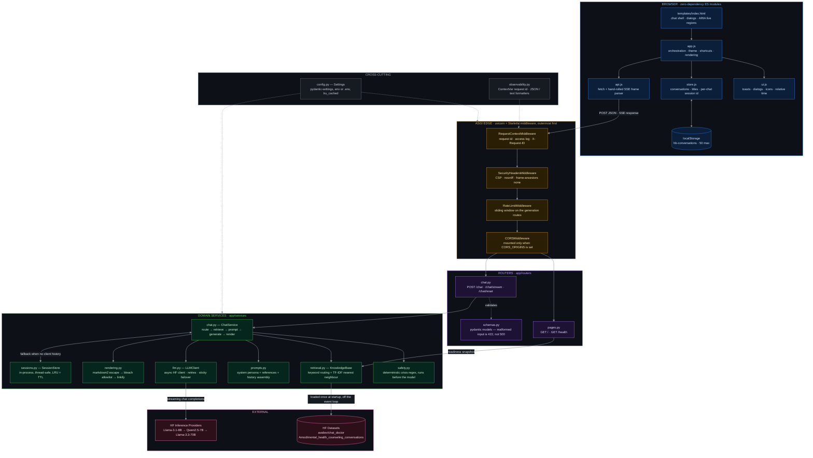
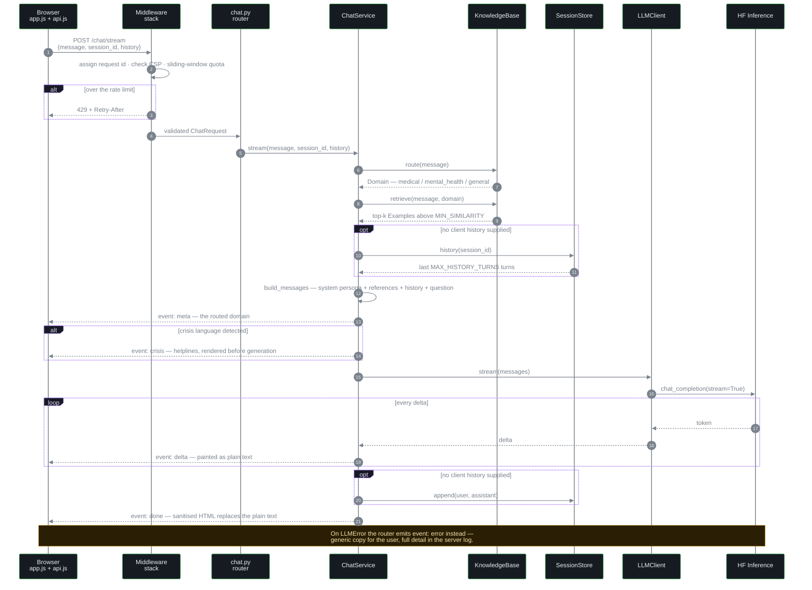
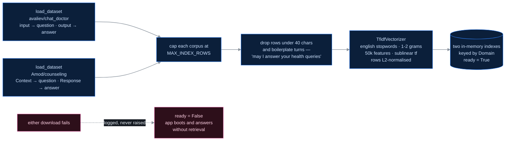
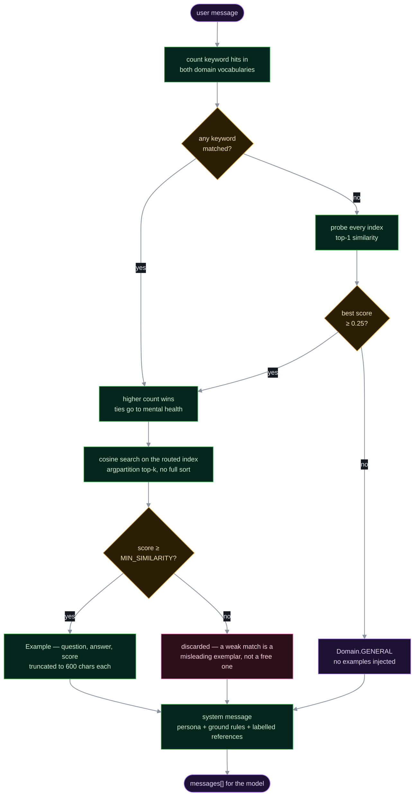
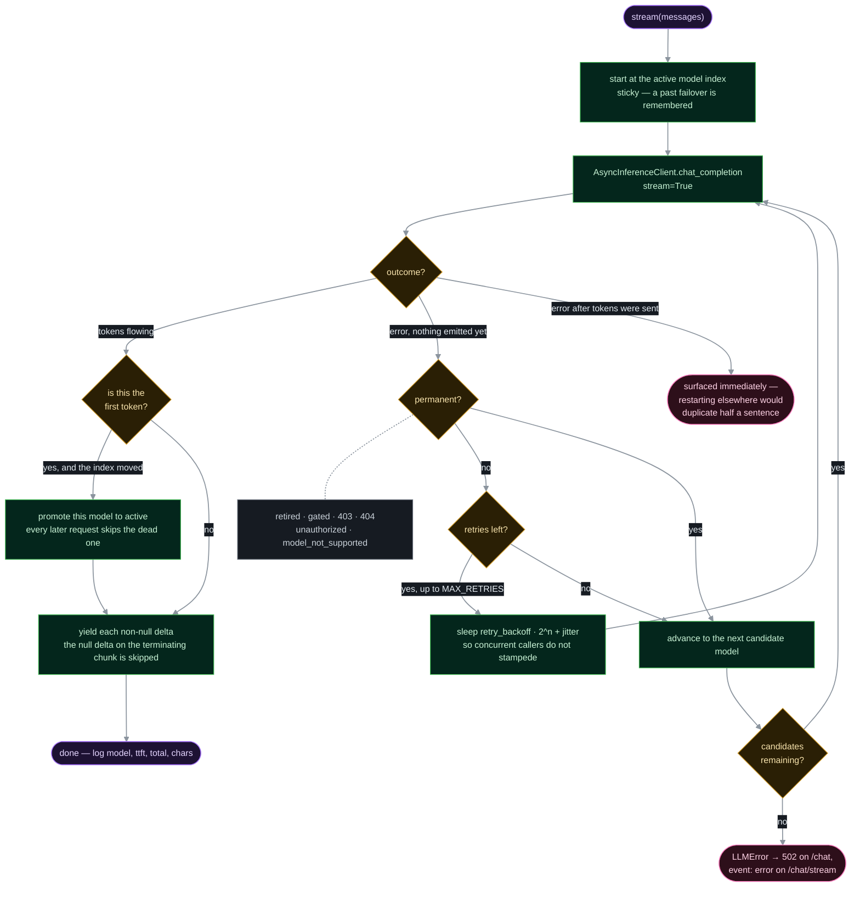
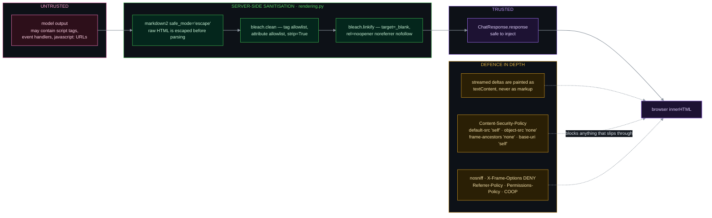
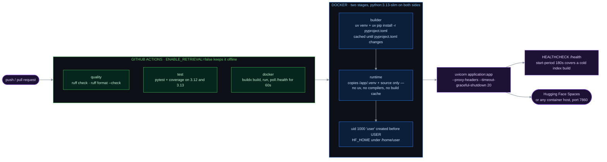

# Harmony Bot v2.1

**Harmony Bot** is a conversational assistant for medical and mental-health
questions. It routes each question to a domain, retrieves genuinely similar
examples from two Hugging Face datasets, and answers with a Llama-3.1 model
served through the Hugging Face Inference API — streamed token by token,
sanitised before it ever touches the DOM.

<sub>FastAPI · Starlette SSE · scikit-learn TF-IDF · Hugging Face Inference Providers · vanilla ES modules · Docker · GitHub Actions</sub>

---

## Contents

- [Features](#features)
- [Architecture](#architecture)
  - [System overview](#system-overview)
  - [Request lifecycle](#request-lifecycle-chatstream)
  - [Index build](#index-build)
  - [Routing and retrieval](#routing-and-retrieval)
  - [Model resilience](#model-resilience)
  - [Trust boundary](#trust-boundary)
  - [Build and deployment](#build-and-deployment)
- [Project structure](#project-structure)
- [Installation](#installation)
- [Configuration](#configuration)
- [API](#api)
- [Observability](#observability)
- [Tests](#tests)
- [Docker](#docker)
- [Limitations](#limitations)
- [What's upgradable](#whats-upgradable)

---

## Features

- **Retrieval-grounded answers** — TF-IDF nearest-neighbour search over ~23k
  real patient/counsellor exchanges, so the injected context actually relates
  to the question.
- **Live token streaming** — replies render as they are generated over SSE.
- **Conversation memory** — a rolling window of recent turns, per session,
  with client-supplied history taking precedence so a restored chat survives a
  server restart.
- **Model failover** — a ranked list of models with sticky failover, retries
  with jittered backoff, and permanent-vs-transient error classification.
- **Crisis safeguards** — deterministic detection of self-harm language, with
  helpline resources surfaced before the model is even called.
- **Sanitised output** — model Markdown is escaped and whitelisted before it
  reaches the DOM, and the page ships a strict CSP.
- **Rate limited** — in-process sliding window on the generation endpoints, so
  one visitor cannot drain the inference quota.
- **Structured logging** — every line carries a request id; JSON in production.
- **Graceful degradation** — if the datasets cannot be fetched, the app still
  boots and answers without retrieval.

### Interface

- **Saved conversations** — grouped by recency, searchable, renameable by first
  message, exportable as Markdown. Stored only in your browser.
- **Resumable context** — a conversation restored after a refresh replays its
  recent turns, so the model keeps its memory even across a server restart.
- **Regenerate** any reply, **stop** mid-generation, **copy** any message.
- **Reader-friendly scrolling** — the view follows new tokens only while you
  are already at the bottom, never yanking the page mid-read.
- **Light / dark / system** theme, applied before first paint.
- **Keyboard-first** — <kbd>Ctrl</kbd>+<kbd>K</kbd> search,
  <kbd>Ctrl</kbd>+<kbd>Shift</kbd>+<kbd>O</kbd> new chat,
  <kbd>Esc</kbd> stop, <kbd>?</kbd> for the full list.
- **Accessible** — skip link, ARIA live regions, visible focus rings, native
  `<dialog>` focus trapping, `prefers-reduced-motion` support.
- **No image or font payload** — the entire UI is CSS and inline SVG.

## Demo

[Harmony Bot on Hugging Face Spaces](https://huggingface.co/spaces/Shabi23/HarmonyBot)

---

## Architecture

Four ideas shape the whole system:

1. **One pipeline, two transports.** `ChatService` owns
   *route → retrieve → prompt → generate → render*. The streaming and
   non-streaming endpoints are two thin adapters over the same code, so they
   can never drift.
2. **The server is effectively stateless.** Conversations live in the browser.
   The in-process `SessionStore` is a convenience for API clients, not the
   source of truth — a client that sends its own `history` wins.
3. **Failure degrades, it does not cascade.** A dead dataset costs retrieval
   quality; a retired model costs a failover hop; a broken stream costs one
   reply. None of them cost availability.
4. **Model output is untrusted input.** It is escaped, allowlisted and
   linkified on the server before the browser is allowed to treat it as markup.

### System overview



### Request lifecycle (`/chat/stream`)

The interesting property here is *ordering*: the domain is announced before
generation, crisis resources are emitted before the first token, and the
sanitised HTML arrives last and replaces everything the browser painted.



### Index build

Both corpora are pulled and indexed once, on a worker thread, so startup never
blocks the event loop and a network failure costs quality rather than uptime.



### Routing and retrieval

v1 always injected `train[0]`, so every medical question was answered against
the same appendectomy case. This runs per request instead.



### Model resilience

v1 pinned a single model id. When `Meta-Llama-3-8B-Instruct` left the Inference
Providers catalogue, every request returned `model_not_supported` and the
product was simply dead. `LLMClient` is built so that cannot happen again.



### Trust boundary

The frontend assigns replies with `innerHTML`, so everything crossing back from
the model is treated as hostile until it has been through `rendering.py`.



### Build and deployment



---

## Project structure

```
application.py               # entrypoint (uvicorn application:app)
app/
  __init__.py                # __version__
  config.py                  # env-backed Settings, lru_cached
  main.py                    # app factory + lifespan wiring
  middleware.py              # CSP/security headers + sliding-window rate limit
  observability.py           # request-id ContextVar, JSON/text logging
  prompts.py                 # system prompt / message assembly
  schemas.py                 # request + response models
  routers/
    chat.py                  # POST /chat, /chat/stream, /chat/reset
    pages.py                 # GET /, /health
  services/
    chat.py                  # route -> retrieve -> prompt -> generate -> render
    llm.py                   # async HF client, retries, sticky failover
    retrieval.py             # TF-IDF index + domain routing over both datasets
    rendering.py             # Markdown -> sanitised HTML
    safety.py                # crisis detection + helpline notice
    sessions.py              # in-memory conversation history (LRU + TTL)
static/
  css/style.css              # design tokens + all UI styling
  js/api.js                  # fetch + SSE parsing
  js/store.js                # conversation persistence (localStorage)
  js/ui.js                   # toasts, dialogs, icons, time formatting
  js/app.js                  # wiring
templates/index.html         # chat UI
tests/
  conftest.py                # stub LLM + offline app fixture
  test_api.py                # endpoints, validation, history threading
  test_services.py           # routing, retrieval, prompts, safety, sanitising
  test_resilience.py         # failover, retries, headers, rate limiting
DockerFile                   # two-stage uv build
.github/workflows/ci.yml     # lint · test matrix · docker build + boot check
```

## Requirements

- Python 3.12+ (numpy 2.5 dropped 3.11)
- A Hugging Face token with inference access

## Installation

```bash
git clone https://github.com/noumanh11/HarmonyBot-v1.0.git
cd HarmonyBot-v1.0

python -m venv venv
source venv/bin/activate      # Windows: venv\Scripts\activate

pip install -r Requirements.txt

cp .env.example .env          # then add your HF_TOKEN
```

Run it:

```bash
uvicorn application:app --host 127.0.0.1 --port 7860
```

Open <http://127.0.0.1:7860>. First start takes a few seconds while the
datasets download and the index builds — it runs on a worker thread, so the
server accepts requests immediately and simply answers without retrieval until
the index is ready. Set `ENABLE_RETRIEVAL=false` to skip it entirely.

<details>
<summary>Using <code>uv</code> instead</summary>

```bash
uv sync --extra dev
uv run uvicorn application:app --port 7860
```

This is what CI does, and it keeps everything inside the project venv.
</details>

## Configuration

Every setting is an environment variable, read by `app/config.py` from the
process environment or a local `.env`. List-valued settings are parsed as JSON,
e.g. `CORS_ORIGINS='["https://example.com"]'`.

**Hugging Face**

| Variable | Default | Purpose |
|---|---|---|
| `HF_TOKEN` | — | Inference token (required for real generation) |
| `MODEL_ID` | `meta-llama/Llama-3.1-8B-Instruct` | Primary model on HF Inference Providers |
| `FALLBACK_MODELS` | `["Qwen/Qwen2.5-7B-Instruct", "meta-llama/Llama-3.3-70B-Instruct"]` | Tried in order when the primary is retired, gated or overloaded |
| `REQUEST_TIMEOUT` | `60.0` | Per-request timeout, seconds |
| `MAX_RETRIES` | `2` | Retries per model for *transient* failures only |
| `RETRY_BACKOFF` | `0.5` | Base for exponential backoff with jitter |

**Generation**

| Variable | Default | Purpose |
|---|---|---|
| `MAX_TOKENS` | `512` | Reply length ceiling |
| `TEMPERATURE` | `0.7` | Sampling temperature |

**Retrieval**

| Variable | Default | Purpose |
|---|---|---|
| `ENABLE_RETRIEVAL` | `true` | Set `false` to boot without the datasets |
| `MEDICAL_DATASET` | `avaliev/chat_doctor` | Medical corpus |
| `MENTAL_HEALTH_DATASET` | `Amod/mental_health_counseling_conversations` | Counselling corpus |
| `MAX_INDEX_ROWS` | `20000` | Rows indexed per corpus |
| `TOP_K` | `2` | Examples injected per question |
| `MIN_SIMILARITY` | `0.12` | Floor below which examples are discarded |

**Conversation memory**

| Variable | Default | Purpose |
|---|---|---|
| `MAX_HISTORY_TURNS` | `8` | Server-side memory window (one turn = user + bot) |
| `SESSION_TTL_SECONDS` | `3600` | Idle lifetime of a session |
| `MAX_SESSIONS` | `1000` | LRU cap, so memory cannot grow without bound |

**Server and operations**

| Variable | Default | Purpose |
|---|---|---|
| `HOST` / `PORT` | `127.0.0.1` / `7860` | Bind address |
| `CORS_ORIGINS` | `[]` | CORS is only mounted when this is non-empty |
| `LOG_LEVEL` | `INFO` | Root log level |
| `JSON_LOGS` | `false` | JSON lines for a log platform; text locally |
| `RATE_LIMIT_REQUESTS` | `20` | Requests per window, per client |
| `RATE_LIMIT_WINDOW_SECONDS` | `60.0` | Sliding-window length |
| `SECURITY_HEADERS` | `true` | Toggle the CSP / hardening middleware |

## API

| Method | Path | Purpose |
|---|---|---|
| `GET` | `/` | Chat UI |
| `GET` | `/health` | Status, version, **active** model, retrieval readiness, indexed docs |
| `POST` | `/chat` | Complete reply as sanitised HTML |
| `POST` | `/chat/stream` | Same pipeline, streamed as SSE |
| `POST` | `/chat/reset` | Clear a session's history (`204`) |
| `GET` | `/docs` | OpenAPI documentation |

`POST /chat` and `POST /chat/stream` accept:

```jsonc
{
  "message": "string, 1-4000 chars",         // required
  "session_id": "opaque id, <= 64 chars",    // optional; generated if absent
  "history": [                                // optional; <= 20 messages
    { "role": "user",      "content": "..." },
    { "role": "assistant", "content": "..." }
  ]
}
```

When `history` is present it **overrides** the server session — that is what
lets a conversation restored from `localStorage` keep its context across a
server restart, and keeps the server effectively stateless.

**SSE events** emitted by `/chat/stream`, in order:

| Event | Payload | Meaning |
|---|---|---|
| `session` | session id | Echoed so the client can thread later turns |
| `meta` | `medical` \| `mental_health` \| `general` | The routed domain |
| `crisis` | HTML | Helpline notice, emitted before generation |
| `delta` | text | One token chunk; the client paints it as plain text |
| `done` | HTML | Sanitised final reply, replaces the streamed text |
| `error` | text | Generic message; the detail is in the server log |

Every frame is `event: <name>\ndata: <json-string>\n\n`, JSON-encoded so a
newline inside the payload cannot break framing.

**Status codes**: `422` for malformed input (caught by pydantic at the edge),
`429` with `Retry-After` when rate limited, `502` when every candidate model
failed. Errors never leak the upstream exception string.

## Observability

- Every response carries `X-Request-ID`. An inbound `X-Request-ID` is honoured,
  so a trace survives a proxy hop.
- The id lives in a `ContextVar`, so it follows the request across `await`
  points without being threaded through every signature.
- `JSON_LOGS=true` emits one JSON object per line; anything passed via
  `extra=` becomes a first-class field. uvicorn's own loggers are routed
  through the same handler.
- Access logs skip `/static`, and generation logs record model, time-to-first-
  token, total duration and character count.

## Tests

```bash
pip install -r requirements-dev.txt
pytest -q
```

The suite runs fully offline against a stub model — no token, no downloads. It
covers the endpoints and their status codes, history threading and overrides,
domain routing, retrieval attribution and the similarity floor, prompt shape,
crisis detection (including false positives), XSS sanitisation, session
eviction, security headers, rate limiting, and the whole failover/retry matrix.

## Docker

```bash
docker build -t harmonybot -f DockerFile .
docker run -p 7860:7860 -e HF_TOKEN=your_token harmonybot
```

Two stages sharing one base image, so the venv copied across finds its
interpreter at the same path. The runtime stage carries only the venv and the
source, runs as uid 1000 (what Hugging Face Spaces expects), and declares a
`HEALTHCHECK` with a 180-second start period to cover a cold index build.

## How it works

1. **Route** — keyword vote across medical and mental-health vocabularies,
   falling back to retrieval similarity when no keyword matches.
2. **Retrieve** — TF-IDF cosine search over the *question* side of the chosen
   corpus, discarding anything below the similarity floor.
3. **Prompt** — persona and reference examples go in a `system` message; the
   user's question stays its own `user` message so the model can tell them
   apart.
4. **Generate** — streamed from the model, token by token, with failover.
5. **Render** — Markdown converted, escaped, and whitelisted before display.

Datasets: [`avaliev/chat_doctor`](https://huggingface.co/datasets/avaliev/chat_doctor)
and [`Amod/mental_health_counseling_conversations`](https://huggingface.co/datasets/Amod/mental_health_counseling_conversations).

## Upgrading from v1

v1 shipped several breaking defects, all fixed here:

- The pinned model (`Meta-Llama-3-8B-Instruct`) was retired from HF Inference
  Providers and returned `model_not_supported` on every request.
- `HF_HOME` was hardcoded to `/app/.cache`, which broke non-Docker runs and
  hid cached credentials.
- Retrieval always injected `train[0]`, so every medical question was answered
  against the same appendectomy case, and the dataset roles were swapped.
- Context, examples and the question were flattened into one `user` string, so
  the model frequently answered the *example* instead of the user.
- The sync inference client was called inside `async def`, blocking the event
  loop for the entire generation.
- Model output went into `innerHTML` unsanitised.
- The Exit button POSTed to `/shutdown`, which never existed.
- The Dockerfile ran `app:app` and set `USER user` without creating the user.

## Limitations

- Conversation history is per-process and in-memory; it does not survive a
  restart or span replicas. The browser copy does.
- Rate limiting is in-process, so it protects one worker, not a fleet.
- There is no authentication.
- Retrieval is lexical (TF-IDF), so paraphrases with no shared vocabulary can
  miss.
- **Not a medical device.** Do not use it for diagnosis or treatment decisions.

## What's upgradable

The seams are deliberately placed so these are swaps, not rewrites:

| Today | Next step |
|---|---|
| `SessionStore` — in-process dict | Redis-backed store behind the same three methods |
| `RateLimitMiddleware` — per-worker deque | Shared limiter at the edge, or Redis token bucket |
| TF-IDF `_Index` | Sentence-embedding index; `search()` keeps its signature |
| Single container | Multiple replicas, once session and rate-limit state are shared |

## Group members

Originally built together at
[shabihassan1/HarmonyBot-v1.0](https://github.com/shabihassan1/HarmonyBot-v1.0);
this repository is the v2 continuation.

1. **Shabi ul Hassan** — [LinkedIn](https://www.linkedin.com/in/shabi-ul-hassan1/)
2. **Abdullah Salman** — [LinkedIn](https://www.linkedin.com/in/abdullah-salman-89253b272/)
3. **Nouman Hafeez** — [LinkedIn](https://www.linkedin.com/in/noumanhafeez11nh/)

## Supervisor

**Dr. Mehreen Alam** — [LinkedIn](https://www.linkedin.com/in/dr-mehreen-alam-5a1b9720/)

## Video demonstration

[](https://youtu.be/w5FbRiV-Vs4)

## License

Apache License 2.0 — see [LICENSE](LICENSE).
